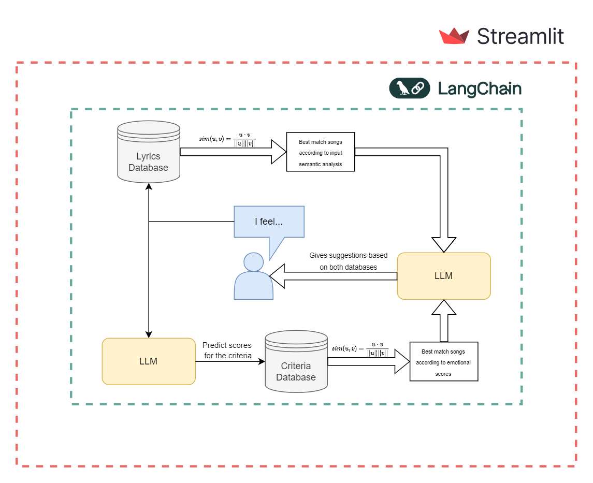
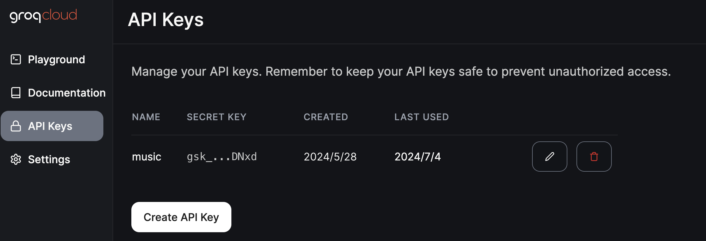
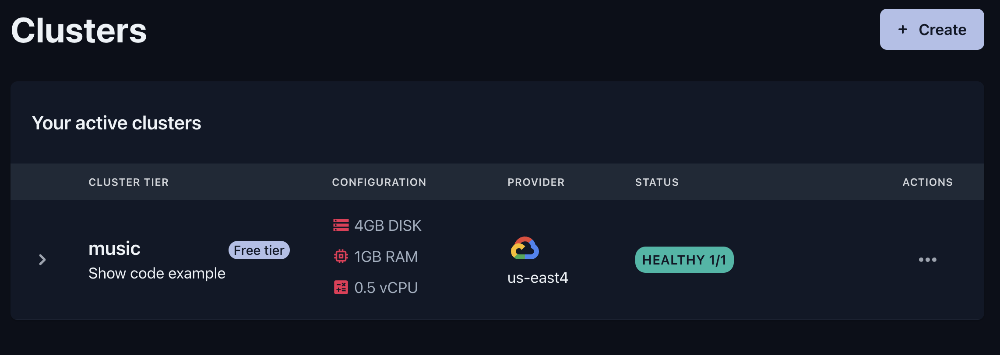
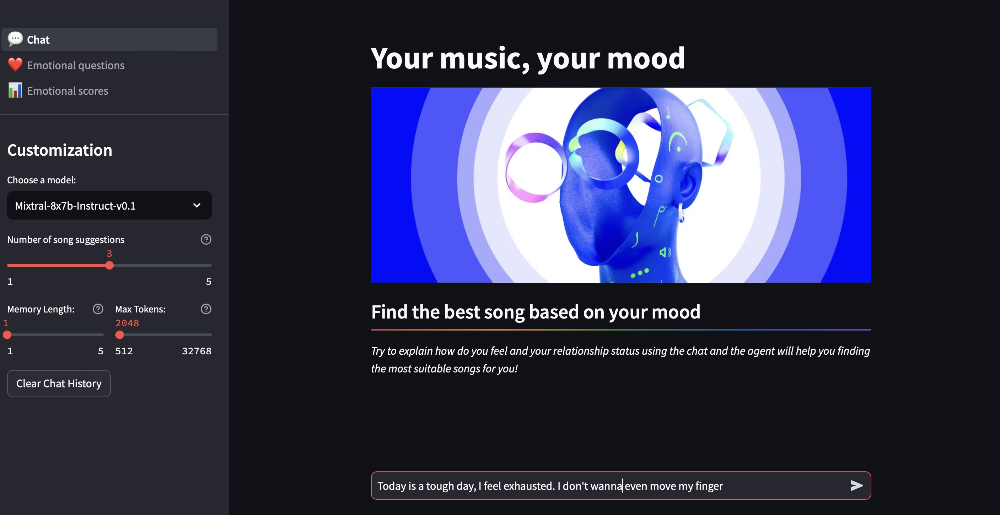
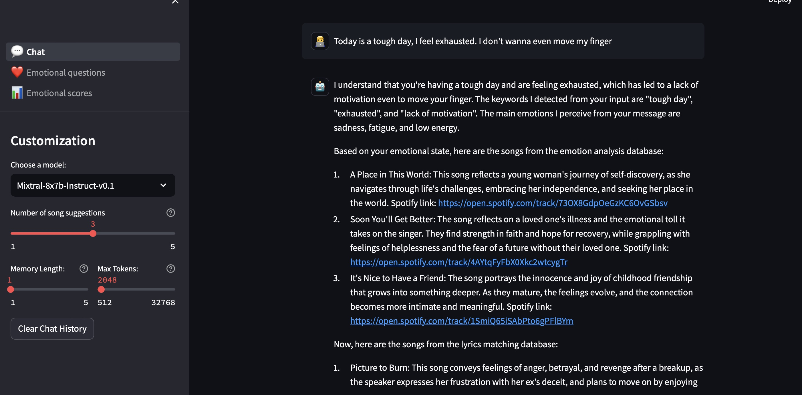
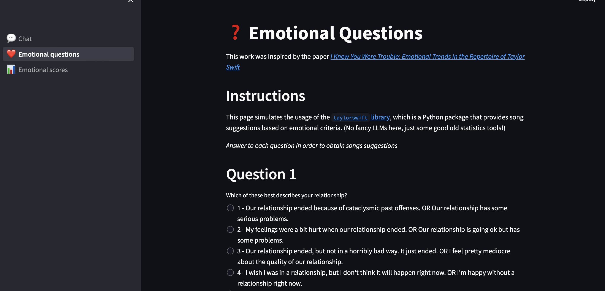

# MusicBot

## Intro

## Version


| Data       | Version | Comment                  | Editor |
| ---------- | ------- | ------------------------ | ------ |
| 2024.05.15 | 0.0.1   | Draft                    | E.W    |
| 2024.05.19 | 0.0.11  | Revise object and future | E.W    |
| 2024.06.12 |   1.0   |          MVP             | Kisho  |
| 2024.07.04 |   1.1   |          Final           | E.W & Kisho  |

## Background


It is a product-type project for the deep learning class.

Music is a common way for most people to release stress, seek comfort, and pass the time. However, major music streaming platforms like Spotify and Apple Music lack mood-based recommendation features. Additionally, they do not seem to effectively integrate AI technology into their products, which can come across as insensitive to users' needs.

## Object

To fill the blank in the market, this project aims to develop a chatbot, leveraging AI to recommend the most suitable playlists based on user input. Users can write down a few sentences about their feelings or fulfill the questionsheet provided then receive their recommendations of music that is close to the mood.

## Architecture



## Usage

### Download 

```git copy git@github.com:callmeeric5/MusicBot.git```

### Prescription

1. Build a Virtual Env if you need

```pip install -r requirements.txt```

2. Go to https://console.groq.com/playground create a project


3. Go to https://qdrant.tech/ create a cluster



4. Creat a `secrets.toml` under the folder `.streamlit`
Enter your API codes from the websites

```
GROQ_API_KEY = 
QDRANT_API_KEY = 
QDRANT_CLIENT_URL = 
```

### Run in local

```cd MusicBot```
```streamlit run 💬_Chat.py```

### Run in docker

```docker build -t musicbot .```

```docker run -p 8501:8501 musicbot```

## 🎉Teda!🎉

Let's start this sepcial journery of music!

* Index example



* Chat example


* Questionsheet example



## Future

- Collaborative recommendation by user portrait.
  
- Enhance model accuracy.​

- Expand dataset beyond Taylor Swift’s songs.​

- Integrate with other platforms for broader use.